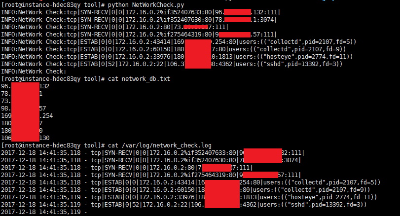

# NetWorkCheck 0.1

本脚本旨在对内网服务器对外链接进行监控，监控对外网链接的进程信息。多数用于不存在或存在少量codeback等服务器环境下，用于事后追溯和事件发现，可作为反弹shell监控的一部分部署。

## Author ##

咚咚呛 

如有其他建议，可联系微信280495355

## Support ##

满足如下安全需求

	1、程序运行不占用cpu等资源；如网络连接存在超过20W的内网链接个数。
	2、对服务器的网络链接进行排查，存在公网IP进行链接时，进行记录；
	3、日志记录差异增加时的公网访问信息；
	

技术细节如下：

	1、底层调用ss命令进行网络链接获取排除；
	2、当前脚本目录保存远程访问记录 network_db.txt；
	3、默认日志目录如：/var/log/network_check.log

## Test Environment ##

>centos 7
>
>python 2.7

## Tree ##

	NetWorkCheck
	----NetWorkCheck.py		   	   #程序主程序

## Deploy ##
	
	脚本放置在任意目录中
	1）$ python FileCheck.py	 尝试运行并生成network_db.txt
	2）配置crontab信息，定时执行，如5分钟一次。
	3）$ cat /var/log/network_check.log 查阅告警日志

## Config ##

配置参数：FileCheck.py

	# 网络连接文件存储名称
	NET_WORK_DB = sys.path[0] + '/network_db.txt'
	# 日志告警文件存储位置
	ALARM_LOG = '/var/log/network_check.log'

## Screenshot ##

